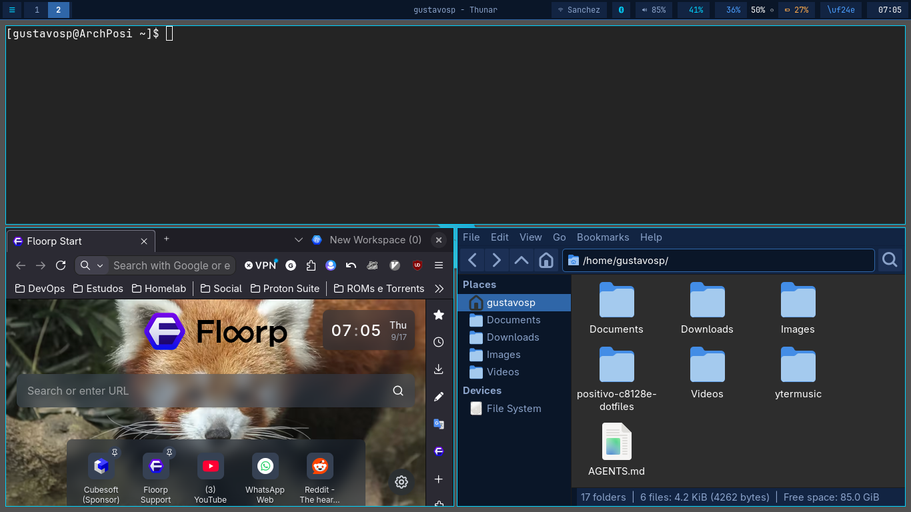
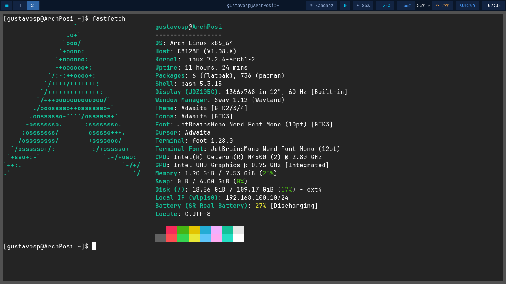

# Screenshots

Capturas reais tiradas no hardware (Positivo C8128E, 1366x768).

## Desktop em tiling

Terminal (foot), floorp e thunar abertos no layout tiled padrão, com a
waybar em cima (workspaces, rede, bluetooth, áudio, CPU, RAM, bateria).

## Terminal com fastfetch

Aparência do terminal (foot + JetBrainsMono Nerd Font): tema Dark Azul
Vibrante (#0a1628 / #2f66a8), gaps de 4px.